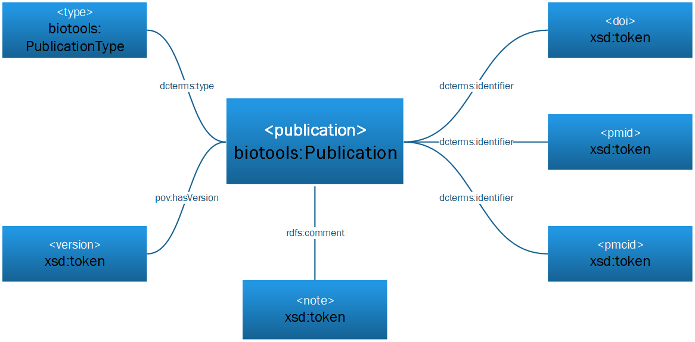

# Introduction
The biotools ontology (biotoolsRDF) defines the OWL2 Web Ontology Language encoding of [biotoolsSchema](https://github.com/bio-tools/biotoolsschema); the resource description model for bioinformatics software.  This document describes the set of classes, properties and restrictions that can be used to represent and interchange information about software provided in different systems and contexts.

biotoolsRDF is fully compatible with biotoolsSchema and thus [bio.tools](https://github.com/bio-tools/biotoolsregistry/); the registry of bioinformatics software resources (https:bio.tools) provided by [ELIXIR](https://www.elixir-europe.org/).

biotoolsRDF is a lightweight ontology and re-uses other well established vocabularies wherever possible.

# Namespaces
biotoolsRDF uses classes and properties from the following vocabularies:

prefix   | namespace IRI                               | definition
-------- | ------------------------------------------- | ----------
rdf      | http://www.w3.org/1999/02/22-rdf-syntax-ns# | The [RDF namespace](https://www.w3.org/TR/prov-o/#bib-RDF-CONCEPTS)
xsd      | http://www.w3.org/2000/10/XMLSchema#        | XML [Schema Namespace](https://www.w3.org/TR/prov-o/#bib-XMLSCHEMA11-2)
prov     | http://www.w3.org/ns/prov#                  | The [PROV namespace](https://www.w3.org/TR/prov-o/#bib-PROV-DM)
edam     | http://edamontology.org#                    | The [EDAM namespace](https://github.com/edamontology/edamontology)
foaf     | http://xmlns.com/foaf/0.1/#                 | The [FOAF namespace](http://xmlns.com/foaf/spec/)
dcterms  | http://purl.org/dc/terms/                   | The [DCMI terms namespace](http://dublincore.org/documents/dcmi-terms/) of Dublin Core Metadata Initiative
dc       | http://purl.org/dc/elements/1.1/            | The [Dublin Core Metadata Element Set](http://dublincore.org/documents/dces/), Version 1.1 (original 15 elements)
dcmitype | http://purl.org/dc/dcmitype/                | Classes in the [DCMI Type Vocabulary](http://dublincore.org/documents/dcmi-type-vocabulary/)


# Classes
biotoolsRDF uses the following classes:

class                        | description | biotoolsSchema
---------------------------- | ----------- | --------------
biotools:Tool                | |
biotools:Function            | |
biotools:Data                | |
edam:Data                    | |
edam:Format                  | |
edam:Operation               | |
xsd:token                    | |
xsd:anyURI                   | | 
biotools:RelatedResource     | |
biotools:RelatedResourceType | |
biotools:Credit              | |
biotools:CreditType          | |
biotools:Publication         | |
biotools:PublicationType     | |

subclasses of biotools:RelatedResourceType:

class                        | description           | biotoolsSchema
---------------------------- | --------------------- | --------------
biotools:LinkType            | Type of link          |
biotools:DownloadType        | Type of download      |
biotools:DocumentationType   | Type of documentation | 


subclasses of biotools:CreditType:

class                        | description           | biotoolsSchema
---------------------------- | --------------------- | --------------
biotools:CreditTypeEntity    |                       |
biotools:CreditTypeRole      |                       | 


## biotools:Function


property              | value          | biotoolsSchema
--------------------- | -------------- | ---------------------
biotools:hasInput     | biotools:Data  | ```<function><input>```
biotools:hasOperation | edam:Operation | ```<function><operation>```
biotools:hasOutput    | biotools:Data  | ```<function><output>```
biotools:cmd          | xsd:token      | ```<function><cmd>```
rdfs:comment          | xsd:token      | ```<function><note>```

## biotools:Data

property               | value       | biotoolsSchema
---------------------- | ----------- | ----------------------------------
biotools:hasDataType   | edam:Data   | <function><input>|<output><Data>
biotools:hasDataFormat | edam:Format | <function><input>|<output><Format>


## biotools:RelatedResource


property                     | value                        | biotoolsSchema
---------------------------- | --------------               | ---------------------
foaf:page                    | xsd:anyURI                   | ```<link>|<download>|<documentation><uri>```
rdfs:comment                 | xsd:token                    | ```<link>|<download>|<documentation><note>```
pov:hasVersion               | xsd:token                    | ```<link>|<download>|<documentation><version>```
dcterms:type                 | biotools:RelatedResourceType | ```<link>|<download>|<documentation><type>```


## biotools:Credit


property                     | value                        | biotoolsSchema
---------------------------- | --------------               | ---------------------
foaf:name                    | xsd:token                    | ```<credit><name>```
foaf:mbox                    | xsd:token                    | ```<credit><email>```
foaf:page                    | xsd:anyURI                   | ```<credit><url>```
dcterms:identifier           | xsd:token                    | ```<credit><orcidid>```
rdfs:comment                 | xsd:token                    | ```<credit><note>```
dcterms:type                 | biotools:CreditType          | ```<credit><typeEntity>|<typeRole>```


## biotools:Publication



property                     | value                        | biotoolsSchema
---------------------------- | --------------               | ---------------------
dcterms:identifier           | xsd:token                    | ```<publication><doi>```
dcterms:identifier           | xsd:token                    | ```<publication><pmid>```
dcterms:identifier           | xsd:token                    | ```<publication><pmcid>```
dcterms:type                 | biotools:PublicationType     | ```<publication><type>```
pov:hasVersion               | xsd:token                    | ```<publication><version>```