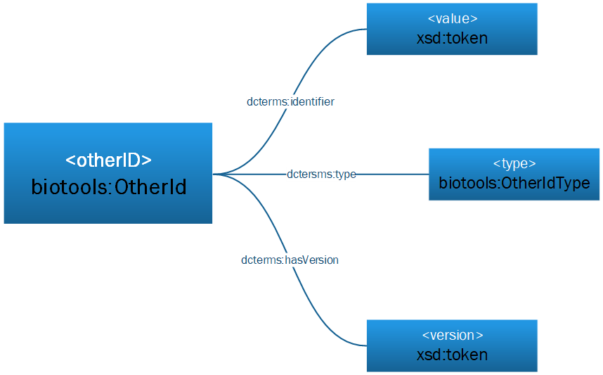
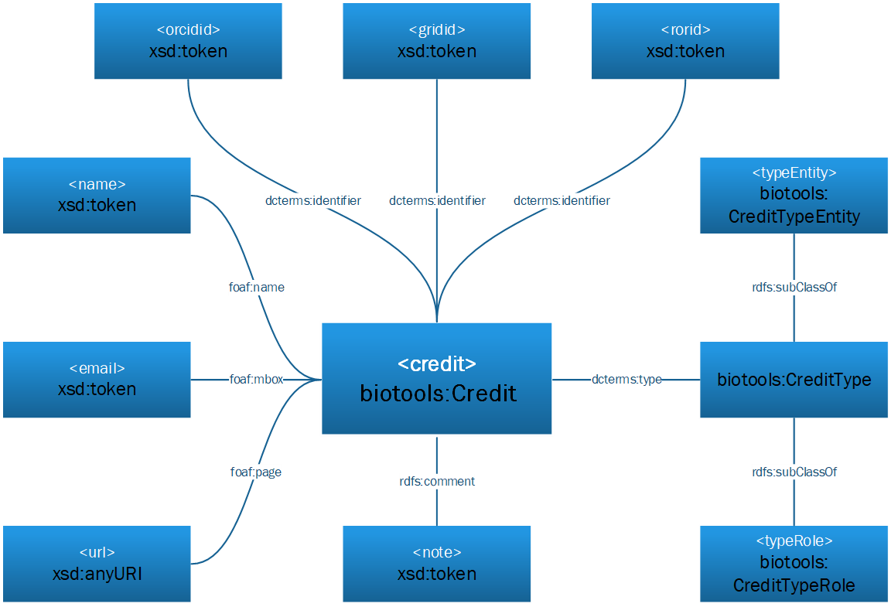

# Introduction

**CAUTION: biotoolsRDF is under construction; please contribute via the [tracker](https://github.com/bio-tools/biotoolsRdf/issues).  New classes and properies are yet to be formally defined.  Refer to [biotoolsSchema](http://github.com/bio-tools/biotoolsschema) and the [EDAM ontology](https://github.com/edamontology/edamontology/) upon which much of biotoolsRDF is based.**

The biotools ontology (biotoolsRDF) defines the OWL2 Web Ontology Language encoding of [biotoolsSchema](https://github.com/bio-tools/biotoolsschema); the resource description model for bioinformatics software.  This document describes the set of classes, properties and restrictions that can be used to represent and interchange information about software provided in different systems and contexts.

biotoolsRDF is fully compatible with biotoolsSchema and thus [bio.tools](https://github.com/bio-tools/biotoolsregistry/); the registry of bioinformatics software resources (https:bio.tools) provided by [ELIXIR](https://www.elixir-europe.org/).

biotoolsRDF is a lightweight ontology and re-uses other well established vocabularies wherever possible.

# Namespaces
biotoolsRDF uses classes and properties from the following vocabularies:

prefix   | namespace IRI                               | definition
-------- | ------------------------------------------- | ----------
rdf      | http://www.w3.org/1999/02/22-rdf-syntax-ns# | The [RDF namespace](https://www.w3.org/TR/prov-o/#bib-RDF-CONCEPTS)
xsd      | http://www.w3.org/2000/10/XMLSchema#        | XML [Schema Namespace](https://www.w3.org/TR/prov-o/#bib-XMLSCHEMA11-2)
prov     | http://www.w3.org/ns/prov#                  | The [PROV namespace](https://www.w3.org/TR/prov-o/#bib-PROV-DM)
edam     | http://edamontology.org#                    | The [EDAM namespace](https://github.com/edamontology/edamontology)
foaf     | http://xmlns.com/foaf/0.1/#                 | The [FOAF namespace](http://xmlns.com/foaf/spec/)
dcterms  | http://purl.org/dc/terms/                   | The [DCMI terms namespace](http://dublincore.org/documents/dcmi-terms/) of Dublin Core Metadata Initiative
dc       | http://purl.org/dc/elements/1.1/            | The [Dublin Core Metadata Element Set](http://dublincore.org/documents/dces/), Version 1.1 (original 15 elements)
dcmitype | http://purl.org/dc/dcmitype/                | Classes in the [DCMI Type Vocabulary](http://dublincore.org/documents/dcmi-type-vocabulary/)


# Classes
biotoolsRDF uses the following classes:

class                        | description                     | biotoolsSchema
---------------------------- | ------------------------        | --------------
biotools:Tool                | Bioinformatics software         | ```<tool>```
biotools:ToolType            | Type of software                | ```<labels><toolType>```
biotools:OperatingSystem     | Supported operating system      | ```<labels><operatingSystem>```
biotools:Language            | Programming language            | ```<labels><language>```
biotools:License             | Software or data usage license  | ```<labels><license>```
biotools:Maturity            | Software development stage      | ```<labels><maturity>```
biotools:OtherId             | Software unique identifier      | ```<summary><otherID>```
biotools:OtherIdType         | Type of software identifier     | ```<summary><otherID><type>```
biotools:Function            | Software function / mode        | ```<function>```
biotools:Data                | Input or output data            | ```<function><input>/<output>```
edam:Data                    | Type of data                    | ```<function><input>/<output><data>```
edam:Format                  | Format of data                  | ```<function><input>/<output><format>```
edam:Operation               | Basic operation / method        | ```<function><operation>```
biotools:RelatedResource     | Link, download or documentation | ```<link>/<download>/<documentation>```
biotools:RelatedResourceType | Type of related resource        | *see below*
biotools:Credit              | Credis of the software          | ```<credit>```
biotools:CreditType          | Type of credit                  | *see below*
biotools:ElixirCredit        | ELIXIR credit                   | *see below*
biotools:Publication         | Publication about the software  | ```<publication>```
biotools:PublicationType     | Type of publication             | ```<publication><type>```
xsd:token                    | String (with restrictions)      | - 
xsd:anyURI                   | URI                             | - 


## Subclasses of biotools:RelatedResourceType

class                        | description           | biotoolsSchema
---------------------------- | --------------------- | --------------
biotools:LinkType            | Type of link          | ```<link><type>```
biotools:DownloadType        | Type of download      | ```<download><type>```
biotools:DocumentationType   | Type of documentation | ```<documentation><type>```


## Subclasses of biotools:CreditType

class                        | description             | biotoolsSchema
---------------------------- | ----------------------- | --------------
biotools:CreditTypeEntity    | Type of credited entity | ```<credit><typeEntity>```
biotools:CreditTypeRole      | Role of credited entity | ```<credit><typeRole>```

## Subclasses of biotools:ElixirCredit

class                        | description              | biotoolsSchema
---------------------------- | ------------------------ | --------------
biotools:ElixirNode          | ELIXIR national node     | ```<labels><elixirNode>```
biotools:ElixirPlatform      | ELIXIR technial platform | ```<labels><elixirPlatform>```


# Properties
biotoolsRDF uses the following properties:

property                    | note
---------------------       | --------------   
biotools:accessibility      | Tool has an accessibility tag
biotools:collectionId       | Tool has assignment to some collection in bio.tools
biotools:cost               | Tool has a monetary cost
biotools:elixirCredit       | Tool has a credited entity
biotools:hasFunction        | Tool has a function/mode of operating
biotools:hasInput           | Tool function/mode has an input
biotools:hasOperation       | Tool function/mode performs some specific operation 
biotools:hasOtherId         | Tool has an identifier (normally other than biotools ID)
biotools:hasOutput          | Tool function/mode has an output
biotools:hasRelatedResource | Tool has a related resource (link, download or documentation)
biotools:maturity           | Tool has assocatited product maturity level
biotools:operatingSystem    | Tool has supported operating system
biotools:cmd                | Tool function/mode has pertinent command-line fragment
biotools:hasDataType        | Input or output is of a certain data type
biotools:hasDataFormat      | Input or output supported in a certain data format
dcterms:description         | Tool has a textual description
dcterms:identifier          | Misc entity has some identifier value
dcterms:language            | Tool has a relevant programming languages(s)
dcterms:license             | Tool has a software or data usage license
dcterms:subject             | Tool has a relevant EDAM topic
dcterms:title               | Tool has a name
dcterms:type                | Misc entity has tags from controlled vocabulary
foaf:name                   | Misc entity has a name
foaf:mbox                   | Credited entity has an email address
foaf:page                   | Misc. entity has a URL
pov:hasVersion              | Misc. entity has an associated version number
rdfs:comment                | Misc. entity has an associated note


# Data model

## biotools:Tool


property                        | value                     | biotoolsSchema
---------------------           | --------------            | ---------------------
dcterms:title (1)               | xsd:token                 | ```<summary><name>```
dcterms:description             | xsd:token                 | ```<summary><description>```
foaf:page                       | xsd:anyURI                | ```<summary><homepage>```
dcterms:identifier              | xsd:token                 | ```<summary><biotoolsID>```
dcterms:identifier              | xsd:token                 | ```<summary><biotoolsCURIE>```
pov:hasVersion                  | xsd:token                 | ```<summary><version>```
dcterms:type                    | biotools:ToolType         | ```<labels><toolType>```
dcterms:subject (2)             | edam:Topic                | ```<labels><topic>```
biotools:operatingSystem        | biotools:OperatingSystem  | ```<labels><operatingSystem>```
dcterms:language                | biotools:Language         | ```<labels><language>```
dcterms:license                 | biotools:License          | ```<labels><license>```
biotools:collectionId           | xsd:token                 | ```<labels><collectionID>```
biotools:maturity               | biotools:Maturity         | ```<labels><maturity>```
biotools:cost                   | biotools:Cost             | ```<labels><cost>```
biotools:accessibility          | biotools:Accessibility    | ```<labels><accessibility>```
biotools:elixirCredit           | biotools:ElixirCredit     | ```<labels><elixirNode>/<elixirPlatform>```
biotools:hasOtherId             | biotools:OtherId          | ```<summary><otherID>```
biotools:hasFunction            | biotools:Function         | ```<function>```
biotools:hasRelatedResource (3) | biotools:RelatedResource  | ```<link>/<download>/<documentation>```


(1) foaf:name also applicable
(2) foaf:topic also applicable
(3) dcterms:relation also applicable?


## biotools:OtherId



property                     | value                        | biotoolsSchema
---------------------------- | --------------               | ---------------------
dcterms:identifier           | xsd:token                    | ```<otherid><value>```
dcterms:type                 | biotools:OtherIdType         | ```<otherid<type>```
pov:hasVersion               | xsd:token                    | ```<otherid><version>```


## biotools:Function


property              | value          | biotoolsSchema
--------------------- | -------------- | ---------------------
biotools:hasInput     | biotools:Data  | ```<function><input>```
biotools:hasOperation | edam:Operation | ```<function><operation>```
biotools:hasOutput    | biotools:Data  | ```<function><output>```
biotools:cmd          | xsd:token      | ```<function><cmd>```
rdfs:comment          | xsd:token      | ```<function><note>```

## biotools:Data

property               | value       | biotoolsSchema
---------------------- | ----------- | ----------------------------------
biotools:hasDataType   | edam:Data   | ```<function><input>/<output><Data>```
biotools:hasDataFormat | edam:Format | ```<function><input>/<output><Format>```


## biotools:RelatedResource


property                     | value                        | biotoolsSchema
---------------------------- | --------------               | ---------------------
foaf:page                    | xsd:anyURI                   | ```<link>/<download>/<documentation><uri>```
rdfs:comment                 | xsd:token                    | ```<link>/<download>/<documentation><note>```
pov:hasVersion               | xsd:token                    | ```<link>/<download>/<documentation><version>```
dcterms:type                 | biotools:RelatedResourceType | ```<link>/<download>/<documentation><type>```


## biotools:Credit



property                     | value                        | biotoolsSchema
---------------------------- | --------------               | ---------------------
foaf:name                    | xsd:token                    | ```<credit><name>```
foaf:mbox                    | xsd:token                    | ```<credit><email>```
foaf:page                    | xsd:anyURI                   | ```<credit><url>```
dcterms:identifier           | xsd:token                    | ```<credit><orcidid>```
rdfs:comment                 | xsd:token                    | ```<credit><note>```
dcterms:type                 | biotools:CreditType          | ```<credit><typeEntity>/<typeRole>```


## biotools:Publication


property                     | value                        | biotoolsSchema
---------------------------- | --------------               | ---------------------
dcterms:identifier           | xsd:token                    | ```<publication><doi>```
dcterms:identifier           | xsd:token                    | ```<publication><pmid>```
dcterms:identifier           | xsd:token                    | ```<publication><pmcid>```
dcterms:type                 | biotools:PublicationType     | ```<publication><type>```
pov:hasVersion               | xsd:token                    | ```<publication><version>```


